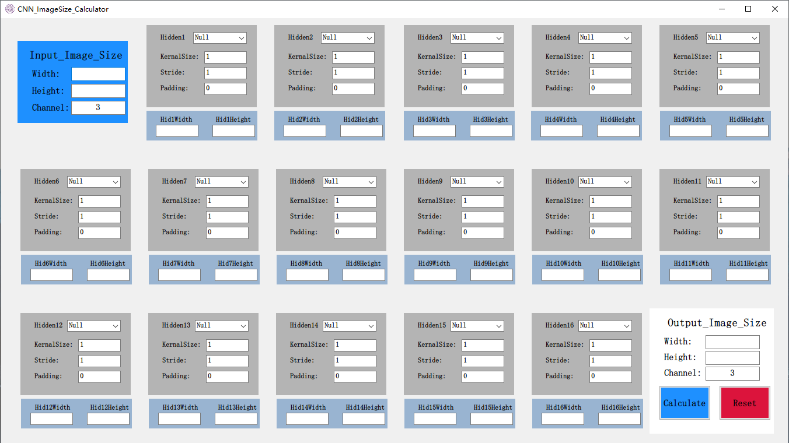
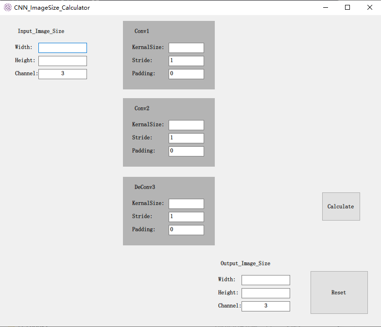
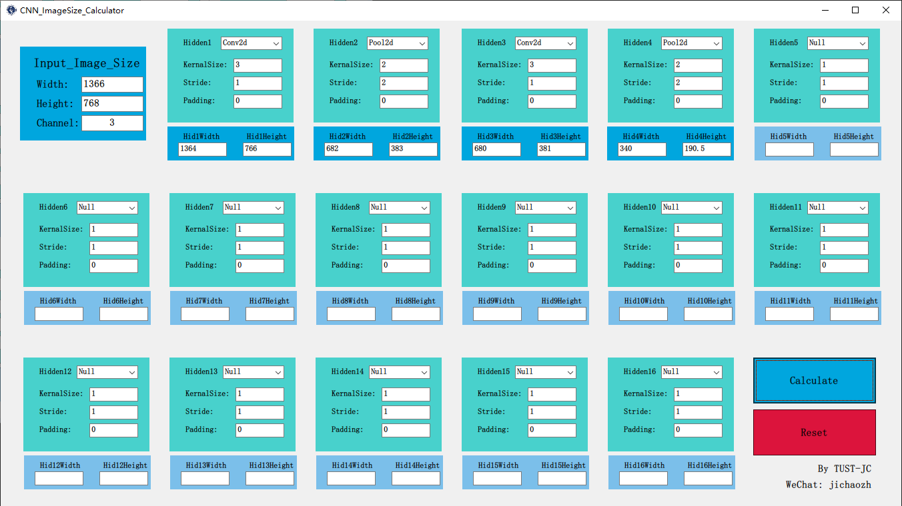

# CNN_ImageSize_Calculator_Win

CNN 图像输入尺寸计算器

根据输入图像尺寸，计算输出图像尺寸

2020-09-22更新日志：

1. 调整了默认颜色的搭配。

2. 当网络模块被调用的时候，输出图像尺寸会变色以突出显示计算结果。

顺带记录一下，这是项目的起源，就是一个简单的数字计算器。

2020-09-23 Update Log：

1. 调整了默认颜色的搭配

